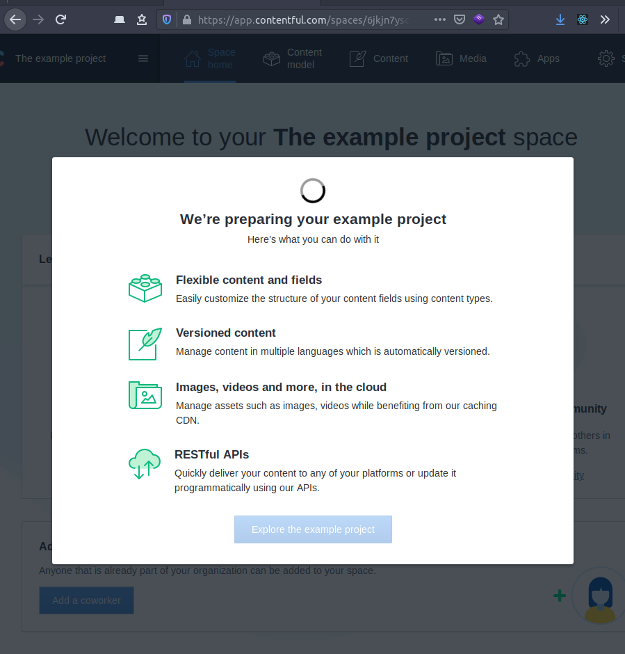
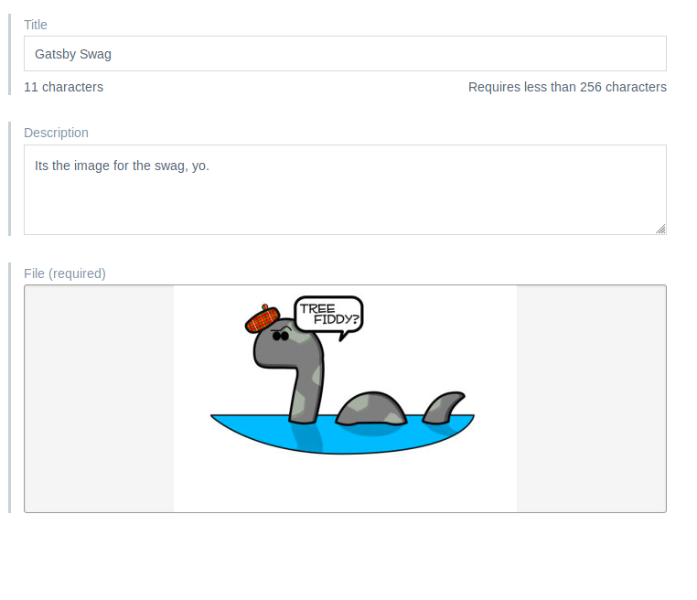

### Headless CMS

In this example we'll be using contentfulA as our _Headless CMS_. What is a headless cms? Lets assume we know what a [CMS](https://en.wikipedia.org/wiki/Content_management_system) is. We can sum that up as a place to put content, and have that content rendered into a website. I'm sure we have all heard of Wordpress and maybe even Drupal. I hope you've never heard of Joomla.

A _headless_ CMS it just a place to add contnet, nothing gets rendered. The CMS does expect to be sending that information around somewhere, likely through an API. So, we'll set that up to pipe the data into Gatsby.

I'm quite fond of my test product. Thank you to whoever made that artwork I stole from memebase, or one of the meme dictionary sites.

