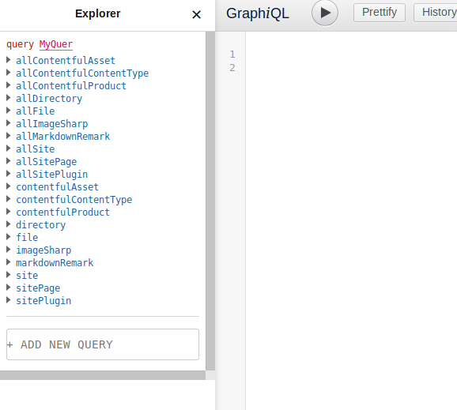
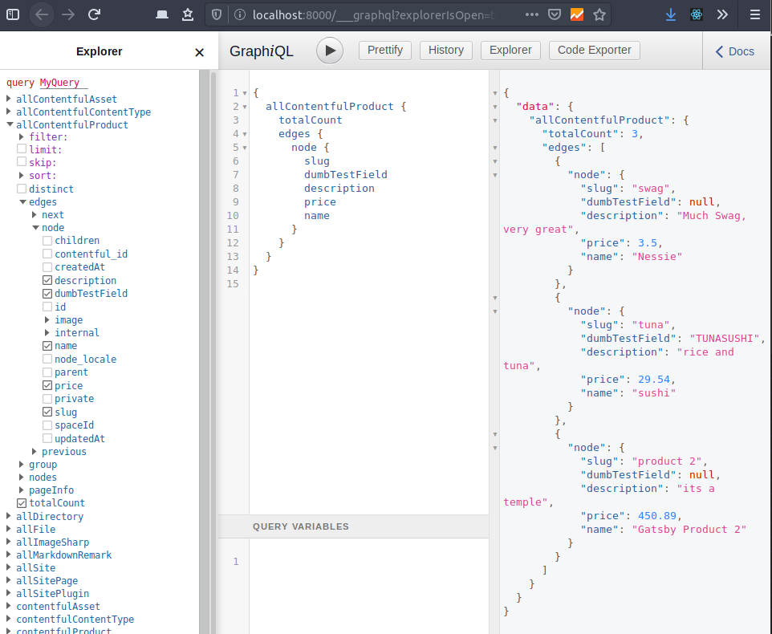
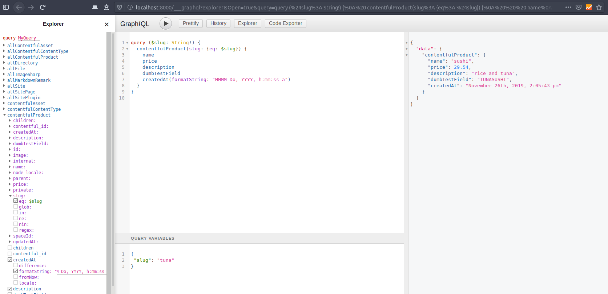
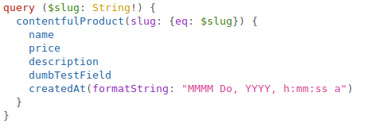
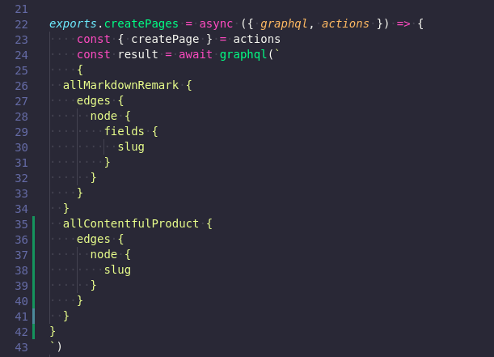
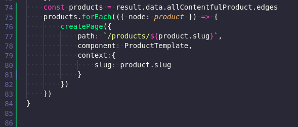
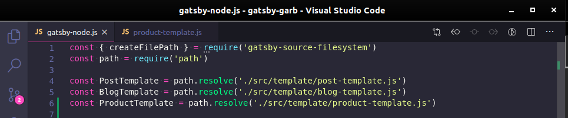
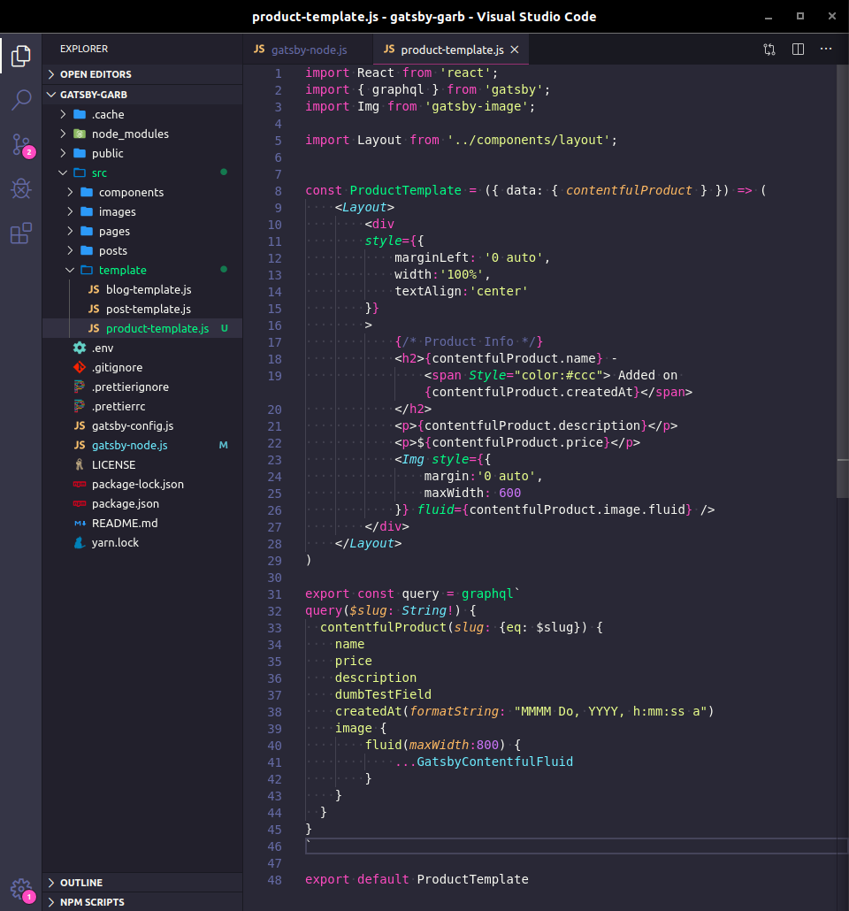
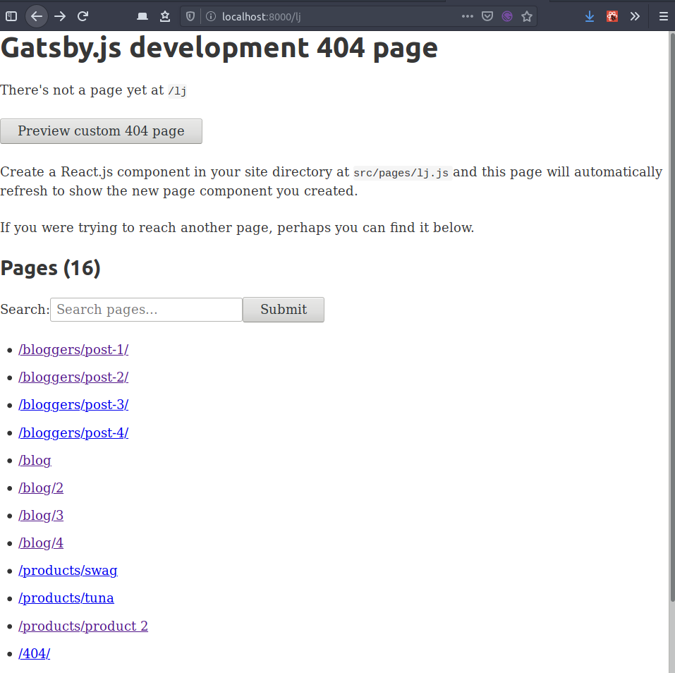
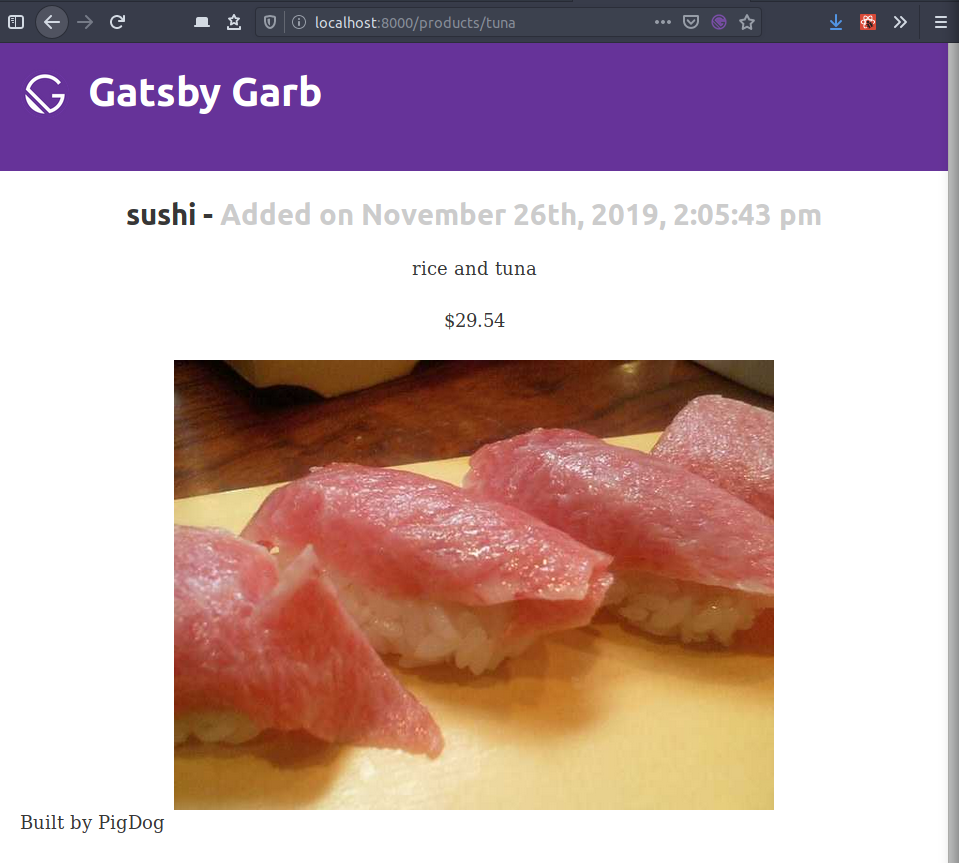

Yesterday we were able to install a few gatsby plugins to work with Contentfuls api. 'gatsby-source-contentful' 

Once we had that pluged in, and talking though `dotenv` [npm dotenv](https://www.npmjs.com/package/dotenv) to Contentful, we have new top level query stuff in GrapiQL.

From there I'm sure you can hazzard a guess as to how we'll query that info and drop it into a new page.

Hint hint, its on [Day17](/day17/). I'm sorry, the images are broken. Lets cover it again, since anything worth doing is worth doing a bunch so we internalize it.

<h4 id="Step1">Step 1 - make a GraphiQL query</h4>

####Step 2 - get fancy with the slug. 
We'll be using a different query than the `allContentfulProduct` one used just able. Don't fret I'll cover the reasoning behind this in a few. Lol, look at me pretending I know whats happening.

Here is a close up.

First thing to notice about the query is our use of the slug variable. We are using the `contentfulProduct` query, which returns a singular product. That in turn gets chosen by the slug variable. We'll be taking advantage of that later on.

Now that we have our query built up, and our slug variable lets head over to our Gatsby repo and start breaking things.

####Step 3 - Gatsby-node.js

We are going to be following the same series of tasks that we used to create pages for each blog post. If you did that before, find the createPages function, otherwise lets make said function.

I copied the `allMakrdownRemark` query and changed it to `allContentfulProduct` and removed the `fields` bit. Keep in mind this is not the same query we just made, we will be using that one in a new file. Now that we have the new query in we need to make a `forEach` loop to build out a page for each product. However we need to do two more things before we can move forward.

Take a close look at line 78 in the above screenshot, we are calling a component `ProductTemplate`. We haven't created that yet, or told Gatsby-node.js where to find it. Lets start by telling Gatsby-node where to look for it, then we will make the file. 

Head up to the top of our current file, Gatsby-node.js and make a new variable called, yes you guessed it, `ProductTemplate`.

Now that we've told Gatsby-node where to look for this product template file, we need to make it.

In this project we have a template folder, so we'll put our file there. At long last we finally get to use our beautiful slug variable query.

####Step 4 - ProductTemplate.js

Go ahead and make the file if you haven't already. We need to import a few things at the top, react, graphl and Img. See screenshot.

From here its fairly straight forward. We have our query, and we interpolate the data out of it into markup.

####Step 5 - Products!

Assuming all has gone well so far and we haven't mistyped anything. We made our update to `gatsty-node.js` which creates the pages, which uses the `product-template.js` file to do so. Now we want to see one of our products. How to do that? Usually in Gatsby if you enter an incorrect url you'll get a list of pages.

In our case this works, lets check out one of our products.

There we have it, a product created from data that we pulled down from our Contentful CMS API! 
