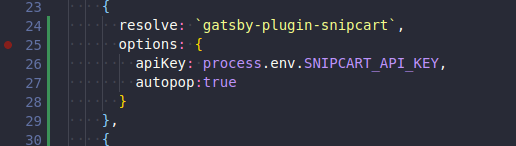
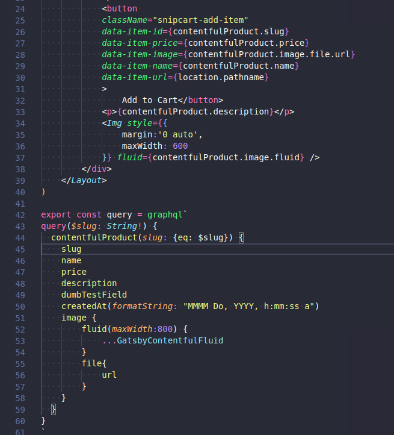
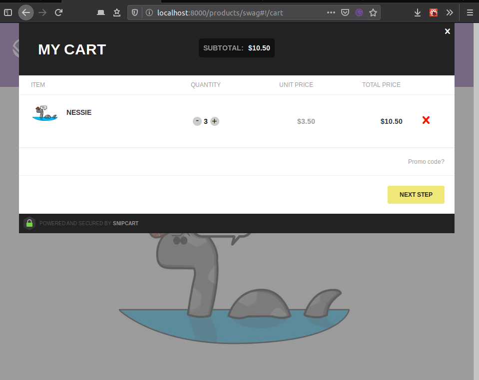

### All products page

On day 37, we had an [all product query as a test](/day37) *Step1*. We will take that, and make a new page to show all the products. 

Again, referring back to day 37, if you look at *Step4* you'll see how we take data from our query and print it on a page. The only differece here is that the query is slightly different, and we should keep it shorter.

Why shorter? 

It is a preview page, maybe just the title and image? What is it you like to see on a list of products page? We should add price in as well.

Something that interested me the most today has been the _tracedSVG_ option you can pass to images. Instead of the blur up effect. Maybe its a passing thing and I'll get tired of it, maybe not. For now I think its great. Read up on it [here](https://using-gatsby-image.gatsbyjs.org/traced-svg/)

### Snipcart

Since today is Saturday of a holiday weekend, I'm up and well rested and spending more time studying. We're also going to cover [Snipcart](https://www.gatsbyjs.org/packages/gatsby-plugin-snipcart/).

By now adding a new plugin should be a regular song and dance. 

#### Npm i 

`npm i gatsby-plugin-snipcart`

#### Api 

Head over to snipcart and sign up for a trial. If their site is to be believed it'll always be free for testing. Once you are signed up, head to profile > api keys & copy that sucker to your clipboard.

#### .env

If you don't have a .env file, this might be a good time to do so. Otherwise go ahead and paste you api key into your gatsby-config file.

If you do have a .env file, put your api key in there. Follow convention. Something along the lines of SNIPCART\_API\_KEY=<your key here>

#### Gatsby-config.js

Tell gatsby config about our new plugin. Then use your env variable if you have it. I like the _look_ of using the .env, so that is what you'll see here.

#### Update product-template.js

Head over to the product template page.I found [this excellent write up on how to add a snipcart button to a page](https://snipcart.com/blog/react-ecommerce-gatsby-tutorial). As you can see, just before step for in the linked article we need to add a bunch of `data-item` attributes to our button.

Here is my version.

There are a few things to note here. Firstly in the contentfulProduct query we added the slug in, this is so we can pass it to snipcart as a unique identifier. We also need to pass in the location. That happens up at the product template variable definition. `const ProductTemplate = ({ data: {contentfulProduct}, location }) =>`..

All those things combined should get us an add to cart button that works, at least as a test.

