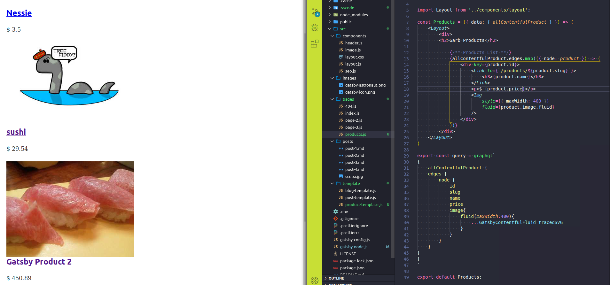

### All products page

On day 37, we had an [all product query as a test](/day37) *Step1*. We will take that, and make a new page to show all the products. 

Again, referring back to day 37, if you look at *Step4* you'll see how we take data from our query and print it on a page. The only differece here is that the query is slightly different, and we should keep it shorter.

Why shorter? 

It is a preview page, maybe just the title and image? What is it you like to see on a list of products page? We should add price in as well.

Something that interested me the most today has been the _tracedSVG_ option you can pass to images. Instead of the blur up effect. Maybe its a passing thing and I'll get tired of it, maybe not. For now I think its great. Read up on it [here](https://using-gatsby-image.gatsbyjs.org/traced-svg/)
