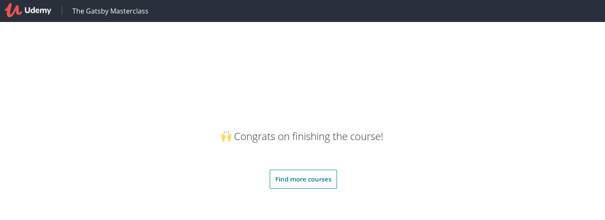

### Shopping cart

In order to add a shopping cart button to the header, we need to modify our header.js. 

Snipcart works by adding classes that start with `snipcart` on elements.

Here is a solid idea of the cart classes needed from [Snipcarts Docs](https://docs.snipcart.com/v3/setup/cart-summary).

### Nav link

In our next video today we spruce up the nav a little with some links to blog and store. 

Of course we want to show an active class if we're on that url, but it sounds like Gatsby is a little off on that compared to React.

Without completely typing everything out from the video, I found a few links that will also get us there.

[diy active links](https://github.com/gatsbyjs/gatsby/issues/7208)

[Frontend Masters](https://frontendmasters.com/courses/gatsby/creating-styling-the-header/)

### Deploy to Netlify

This really doesn't need much info at all, Netlify takes you right through these settings.

The one thing that this video does cover, is adding env variables.

### Netlify 

The last two videos are about setting up users on Netlify, and creating private products for signed in only users. The videos cover converting components to state components, which I will review in depth again in the future.

## FIN

